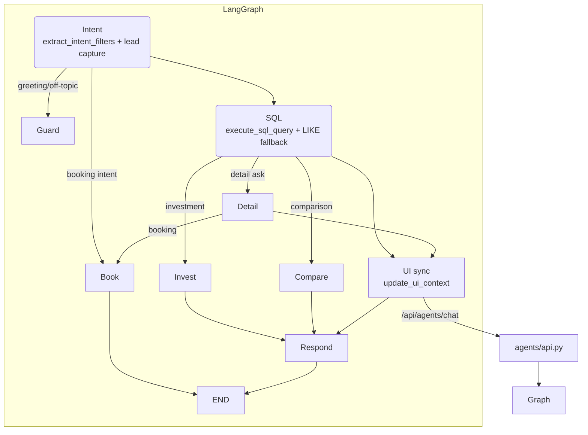

# Silver Land Properties AI Assistant — LangGraph-based deterministic workflow

Production-grade real-estate concierge built on Django + LangGraph with deterministic tool routing (intent → SQL → detail/analysis → respond).
Text-to-SQL is powered by **Vanna**; you can retrain/seed it with sample queries.

This flow **does not rely on a RAG tool** for answering semantic questions; instead, it routes amenity/description questions to a **detail node** that surfaces the full project row (description, features, facilities) as context—acting like lightweight retrieval without embedding/indexing costs. Examples: “What amenities does The OWO Residences have?” or “Does this project include a cinema?” are answered from SQL/detail context, not a vector store. Uses Azure/OpenAI for LLM + embeddings (only needed if you optionally run the RAG ingestion script).

**There is also an agentic (LLM-decides-tools) flow on the `main` branch** if you prefer that style: https://github.com/priyaank17/real-estate-ai-assistant/tree/main.

---
## Project structure (key dirs)
```
real-estate-ai-assistant/
├── agents/          # Django app (API, LangGraph wiring, models)
├── tools/           # SQL, booking, intent, investment, comparison tools
├── frontend/        # Static chat UI (show-all rows toggle)
├── scripts/         # seed_database.py, vanna_setup.py, ingest_rag.py
├── helpers/         # Vanna client, vectorstore helpers
├── docs/            # Architecture docs, setup guides
├── data/            # properties.csv and other seeds
├── silver_land/     # Django project settings/urls/wsgi
├── db.sqlite3       # default SQLite DB
├── tests/           # pytest-based tests (tools + API)
└── manage.py        # Django entrypoint
```

## Quick Start (local dev)

**Clone & install**
```bash
git clone https://github.com/priyaank17/real-estate-ai-assistant.git
cd real-estate-ai-assistant
python -m venv venv
source venv/bin/activate  # Windows: venv\Scripts\activate
pip install -r requirements.txt
```

**Configure env & migrate**
```bash
cp .env.example .env   # then edit with your keys
python manage.py migrate
```

**Seed data & train Vanna text-to-SQL**
```bash
python scripts/seed_database.py
python scripts/vanna_setup.py   # primes Vanna with schema + sample queries
```

**Run backend**
```bash
python manage.py runserver 8000
```

**Optional: static frontend**
```bash
python -m http.server 4000 -d frontend   # visit http://localhost:4000
```

### What the above does
- **Install & configure**: sets up venv, installs deps, and applies migrations.
- **Run backend**: `manage.py runserver` starts the LangGraph-powered API on port 8000.
- **Run frontend (optional)**: static chat UI with show-all toggle for result tables on port 4000.

### Vanna (text-to-SQL) setup
- The SQL tool uses Vanna (helpers/vanna.py) for text-to-SQL.
- Train/prime Vanna with schema + sample queries:
  ```bash
  # Ensure Azure/OpenAI keys are in .env
  python scripts/vanna_setup.py
  # (optionally) seed additional examples in scripts/seed_vanna2_memory.py
  ```
- You can add more examples by editing `scripts/vanna_setup.py` (the seed list includes common filters like city/bedrooms/price). Re-run the script whenever schema or examples change.

Minimal `.env` (Azure strongly recommended):
```bash
AZURE_OPENAI_API_KEY="..."
AZURE_OPENAI_ENDPOINT="https://<resource>.openai.azure.com/"
AZURE_OPENAI_API_VERSION="2024-05-01-preview"
AZURE_OPENAI_CHAT_DEPLOYMENT="gpt-4o-mini"
AZURE_OPENAI_EMBED_DEPLOYMENT="text-embedding-3-small"
# Fallback: OPENAI_API_KEY=... OPENAI_LLM_MODEL=gpt-4o-mini
```

---

## Architecture (feature/langgraph-tools)

Deterministic LangGraph (no LLM tool-calling ambiguity):



Routing rules (high level):
- **Intent**: extracts filters (city/price/beds/type/features), project/developer, detail/listing flag, investment/comparison intent, greeting/off-topic, lead name/email (stored immediately).
- **SQL**: Vanna text-to-SQL; for project/dev/feature queries uses broad LIKE across name/description/features/facilities/developer/city. Shortlist is replaced each turn. Preview limited to 3 rows; full rows are sent via `data_sync` for the frontend “Show all rows” table.
- **Detail**: best-match row by project name from current SQL rows; falls back to direct fetch. Drops “project name not available”.
- **Investment/Comparison**: run tools on selected/shortlist ids.
- **Booking**: resolves project from shortlist/selection/name; requires email; books via `book_viewing` and returns confirmation without the LLM.
- **Respond**: detail mode uses only the detail row (amenities/description/all columns). Listing mode summarizes up to 3 matches; sends `data_sync` payload (rows/row_count/preview) for UI rendering.

---

## Tools
- `extract_intent_filters` — intent + filters + lead parsing, flags for greeting/off-topic/detail/investment/comparison.
- `execute_sql_query` — Vanna SQL + LIKE fallback; returns rows, `row_count`, `project_ids`, `preview_markdown`.
- `fetch_project_row` — single project with all columns (features/facilities/description).
- `update_ui_context` — sync shortlist ids to the browser.
- `book_viewing` — upserts lead, writes visit booking; confirmation returned directly.
- `analyze_investment` — price-per-sqm, yield heuristic, investment score for selected/top projects.
- `compare_properties` — side-by-side metrics + preview table for 2 projects.
- `data_sync` (virtual) — emitted by `respond`; carries rows/row_count/preview/detail so the UI can render previews and the “Show all rows” table.

## Models used (this flow)
- **Chat/agent & intent LLM**: Azure OpenAI (`AZURE_OPENAI_*` + `AZURE_OPENAI_CHAT_DEPLOYMENT`) if set; otherwise OpenAI (`OPENAI_API_KEY` + `OPENAI_LLM_MODEL`). Optional: set `USE_OLLAMA_FOR_INTENT=true` + `OLLAMA_MODEL` to force intent extraction to use Ollama; if not set, Ollama is ignored.
- **Text-to-SQL (Vanna)**: uses the same Azure/OpenAI keys defined above.
- **Embeddings**: only needed if you run `scripts/ingest_rag.py` (uses `AZURE_OPENAI_EMBED_DEPLOYMENT` or `OPENAI_EMBEDDING_MODEL`).

## Key tables
- `projects` (`agents_project`): property metadata (name, city, beds, price, description, features/facilities, etc.).
- `leads` (`agents_lead`): first name, last name, email, preferences.
- `bookings` (`agents_booking`): legacy bookings.
- `visit_bookings` (`visit_bookings`): confirmed visit bookings (used by `book_viewing`).

---

## API

### `POST /api/agents/chat`
```bash
curl -X POST http://localhost:8000/api/agents/chat \
  -H "Content-Type: application/json" \
  -d '{"message": "Find apartments in Dubai under 2M"}'
```

Sample response (listing):
```json
{
  "response": "Here are 3 matches under 2M USD in Dubai: ...",
  "conversation_id": "uuid",
  "data": {
    "rows": [
      {"id": "a73e...", "name": "Safa One by de Grisogono", "city": "Dubai", "bedrooms": 3, "price": 1005159},
      {"id": "06c4...", "name": "Altitude by Damac & de Grisogono", "city": "Dubai", "bedrooms": 2, "price": 1203365}
    ],
    "row_count": 26,
    "shortlisted_project_ids": ["a73e...", "06c4...", "..."],
    "preview_markdown": "| id | name | city | price | ... |"
  },
  "tools_used": ["extract_intent_filters", "execute_sql_query", "update_ui_context", "data_sync"],
  "preview_markdown": "| id | name | city | price | ... |",
  "citations": [
    {"project_id": "a73e...", "project_name": "Safa One by de Grisogono", "city": "Dubai"}
  ]
}
```

Detail response includes `data.detail` with all columns. Booking confirmations return a plain message plus booking id (no LLM).

### `POST /api/agents/conversations`
Creates a conversation id for threading multiple `/chat` calls.
```bash
curl -X POST http://localhost:8000/api/agents/conversations
# -> {"conversation_id": "<uuid>"}
```

### `GET /api/agents/chat/stream`
Server-sent events version of `/chat`; emits incremental `chunk` events and a final payload with the same fields as `/chat`.

---

## Frontend (static)
- `frontend/index.html` consumes the API; shows chat, tools used, citations, preview table.
- “Show all rows” toggle renders the full table from `data.rows` when present; default view shows the 3-row preview.
- Use “Reset storage” to clear `api_base`/conversation in localStorage if switching backends.

Start:
```bash
python -m http.server 4000 -d frontend
# then open http://localhost:4000 (set API_BASE if not http://localhost:8000)
```

---

## Optional: RAG Ingestion
Semantic search over descriptions/facilities (used when enabled):
```bash
python scripts/ingest_rag.py   # uses Azure/OpenAI embeddings
```

---

## Testing Tips
- SQL search: `{"message": "Find 2 bedroom apartments in Dubai"}`.
- Detail: `{"message": "Amenities for The OWO Residences London"}`.
- Booking: `{"message": "Book my visit to Downtown Dubai Residences for Priya (priya@example.com)"}`.
- Investment: `{"message": "Investment analysis for The OWO Residences"}`.
- Comparison: `{"message": "Compare Burj Binghatti and Safa One"}`.

---

## Troubleshooting
- **No key / 401**: ensure Azure variables are set in `.env`.
- **429 / rate limits**: reduce requests or switch to a different deployment.
- **Bad JSON in UI**: data_sync now strips NaN/inf; clear localStorage and retry.
- **Booking shows raw dict**: booking flow now emits a human-readable confirmation (no LLM call).

---

### Tests
- The `tests/` folder exercises tools and API surfaces. To run:
```bash
pytest -q
```
Ensure your `.env` has valid Azure/OpenAI keys and that you’ve migrated/seeded the database before running. Test doubles patch tool outputs where needed; update snapshots if you adjust tool schemas.
